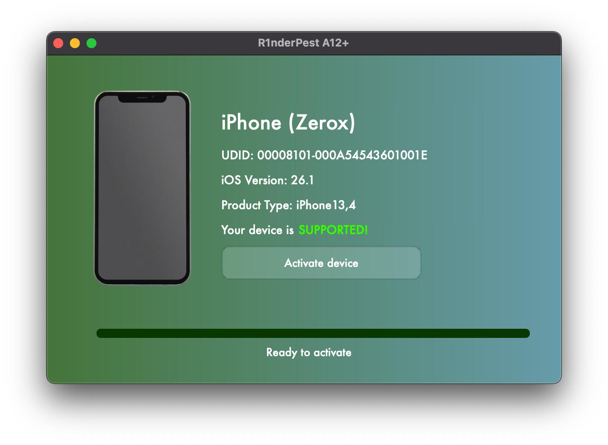

Activation is broken but it will be fixed

# R1nderpest
<div>
  
</div>

Work in progress offline A12+ activator.

## Repository Structure

```
.
├── LICENSE
├── README.md
├── client/                # Python client application
│   ├── activator.py       # Main automation entry point
│   └── README.md          # Client-specific documentation
├── client.cs              # C# client source
├── client_windows.cs      # Windows C# client source
├── ios.exe                # Windows executable
├── offline_bypass.py      # Offline bypass script
└── server/                # PHP backend infrastructure
    ├── SETUP.md           # Server deployment guide
    ├── assets/            # Device configuration storage
    ├── cron/              # Cron job scripts
    ├── public/            # Web root
    └── templates/         # SQL templates for payload generation
```


## Prerequisites

- Python 3.6+

- `libimobiledevice` (via Homebrew on macOS)

- `pymobiledevice3` (via pip)

- `curl`

## Tutorial

1. Download the repository and unzip it
2. cd inside the repository
3. Run ```sudo python3 offline_bypass.py```
4. Make sure your device is connected via usb
5. Type your password
6. Select 1 to fetch your GUID
7. Let the program run
